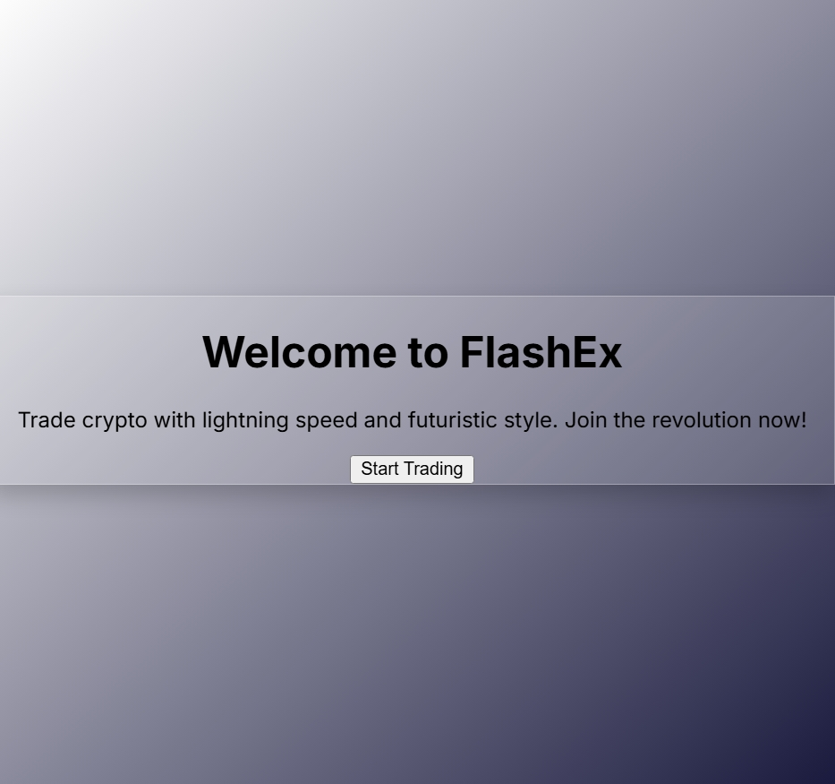
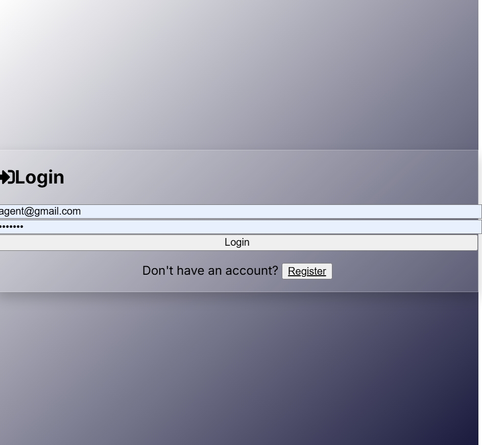
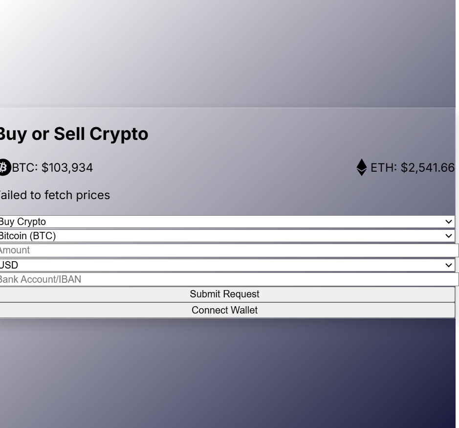
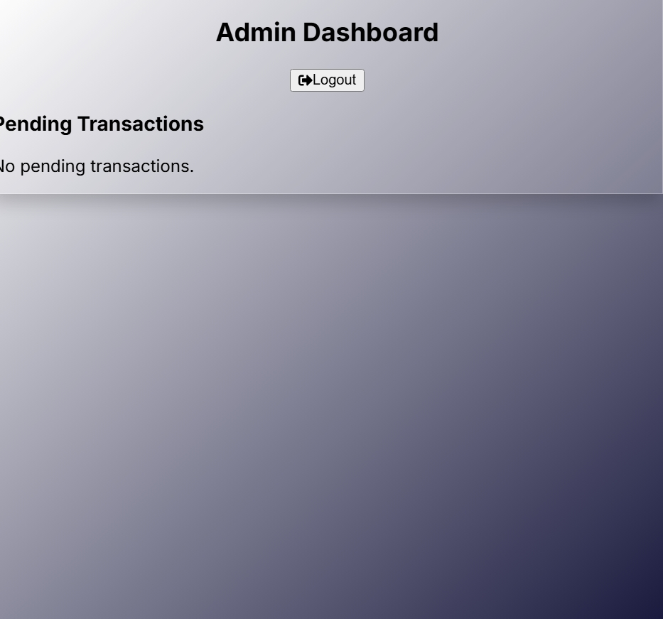

# FlashEx

A futuristic crypto-to-fiat exchange platform with a stunning UI. Users register with a role (user or admin), log in, and access role-specific dashboards. Features real-time crypto prices, wallet integration, transaction management, email notifications, and a responsive design with a cyan/neon-green palette.

## Table of Contents
- [Features](#features)
- [Tech Stack](#tech-stack)
- [Screenshots](#screenshots)
- [Setup](#setup)
- [Usage](#usage)
- [Contributing](#contributing)
- [License](#license)

## Features
- **Futuristic UI**: Glassmorphism, cyan gradients, neon accents, and smooth animations.
- **Auth System**: Toggleable login/register with glowing inputs and role selection.
- **Real-Time Prices**: Live BTC/ETH prices with neon green/red changes (CoinGecko API).
- **Role-Based Access**: Users access Buy/Sell and Dashboard; admins manage transactions.
- **Navigation**: Minimal header on landing; in-page navigation elsewhere.
- **Responsive Design**: Optimized for mobile, tablet, and desktop.
- **Wallet Integration**: Connect MetaMask for transactions.
- **Email Notifications**: Admins receive emails for new requests (SendGrid).
- **Dark/Light Theme**: Toggleable theme with vibrant gradients.

## Tech Stack
- **Frontend**: React, Tailwind CSS, Web3.js, Axios, Framer Motion, React Router, React Icons
- **Backend**: Node.js, Express, MongoDB, Mongoose, Nodemailer, JWT, Bcrypt
- **APIs**: CoinGecko (prices), SendGrid (emails)
- **Tools**: Git, MongoDB Atlas

## Screenshots
A visual overview of the application:

### Welcome Page

The landing page with a futuristic UI and minimal header.

### Login/Register Page

The toggleable authentication interface with glowing inputs and role selection.

### User Dashboard

The user dashboard for managing crypto transactions and viewing real-time prices.

### Buy or Sell Dashboard

The interface for users to buy or sell cryptocurrencies.

### Admin Dashboard

The admin dashboard for managing transactions and receiving notifications.

## Setup

### Prerequisites
- Node.js (v16 or higher)
- MongoDB (local or MongoDB Atlas)
- Git
- MetaMask browser extension (for wallet integration)
- SendGrid account (for email notifications)

### Backend
1. Clone the repository:
   ```bash
   git clone https://github.com/Jahmax1/flashex.git
   cd flashex